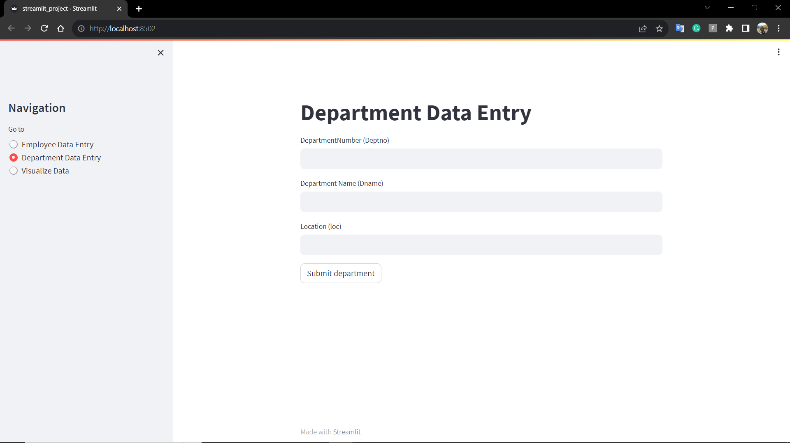

# Streamlit Employee and Department Management

This project demonstrates the creation of a Data Entry application using Streamlit for managing employee and department data. The application consists of three pages, each serving specific functionalities. It allows users to input employee and department data, and visualize the joined data.

## Table of Contents

- [Introduction to Streamlit Project](#streamlit-employee-and-department-management)
  - [Introduction to Streamlit](#introduction-to-streamlit)
  - [How to Use Streamlit](#how-to-use-streamlit)
    - [Installation](#installation)
    - [Test](#test)
    - [Run](#run)
  - [Project Description](#project-description)
    - [Installation](#installation)
    - [Usage](#usage)
  - [Images](#images)
  - [References](#references)

## Introduction to Streamlit

[Streamlit](https://streamlit.io/) is an open-source Python library that allows you to create interactive web applications for data science and machine learning projects with minimal effort. It enables you to transform data scripts into shareable web apps without requiring expertise in web development.

## How to Use Streamlit

### Installation
`pip install streamlit`

### Test
`streamlit hello`

### Run
`streamlit run file_name.py`

## Project Description

This project implements a Data Entry application for managing employee and department data. The application provides three main functionalities:

1. **Employee Data Entry**: Users can input employee details, including Employee Number (Empno), Employee Name (Ename), Job, and Department Number (Deptno).

2. **Department Data Entry**: Users can input department data, including Department Number (Deptno), Department Name (Dname), and Location (Loc).

3. **Visualize Data**: The application visualizes the joined employee and department data based on the common 'Deptno' field.

### Installation

To set up and run the project:

1. Clone the repository: `git clone https://github.com/rabinghimire2023/streamlit_project.git`
2. Create a virtual environment: `python -m venv venv`
3. Activate the virtual environment: `.\venv\Scripts\activate` (Windows) or `source venv/bin/activate` (Linux/macOS)
4. Install dependencies: `pip install -r requirements.txt`
5. Run the Streamlit app: `streamlit run streamlit_project.py`

### Usage

1. Open a web browser and go to `http://localhost:8501` (Streamlit's default port) to access the application.
2. Navigate through the application's pages to input employee and department data and visualize the joined data.

## Images

Here are some images from the project:

*Employee Data Entry Page*

*Department Data Entry Page*

*Visualize Data Page*

## References

- [Streamlit Documentation](https://streamlit.io/docs/)
- [FastAPI Documentation](https://fastapi.tiangolo.com/)
- [SQLite Documentation](https://www.sqlite.org/docs.html)
- [Python Documentation](https://docs.python.org/3/)

